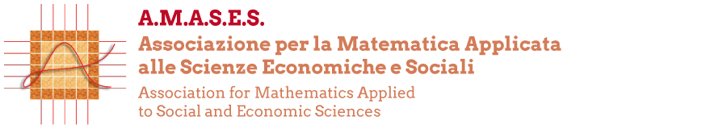

<h1>PhD Theses</h1>

This is a list of {{ site.data.theses | size }} PhD theses in fields related to <a href="https://www.amases.org">AMASES</a> (Association for Mathematics
Applied to Economic and Social Sciences). It collects entries submitted by authors or supervisors, as well as all works archived by the <a href="https://tesidottorato.depositolegale.it">Biblioteca Centrale di Firenze</a> under the 2000 code for "Mathematical Methods for Economics, Finance, and Insurance". Titles are formatted according to language conventions: capitalized in English, lowercased in Italian or French.   
  
Requests for additions or corrections are welcome: just <a href="mailto:alessandra.cretarola@unich.it">email us</a>.




<nav class="year-nav">
  
    <a href="#{{ year.name }}">{{ year.name }}</a>
  
</nav>



<section id="{{ year.name }}">
  <h2 class="year-heading">{{ year.name }}</h2>
  <ul class="thesis-list">
    
    <li>
      
<strong>{{ thesis.firstname }} {{ thesis.lastname }}</strong> ({{ thesis.affiliation }}, {{ thesis.year }})

      
<a href="{{ thesis.url }}" target="_blank" rel="noreferrer">{{ thesis.title }}</a>

      
      

        Supervisor: {{ thesis.supervisors[0] }}
        Supervisors:
          {{ supervisor }} and , 
        
      

      
    </li>
    
  </ul>
</section>

